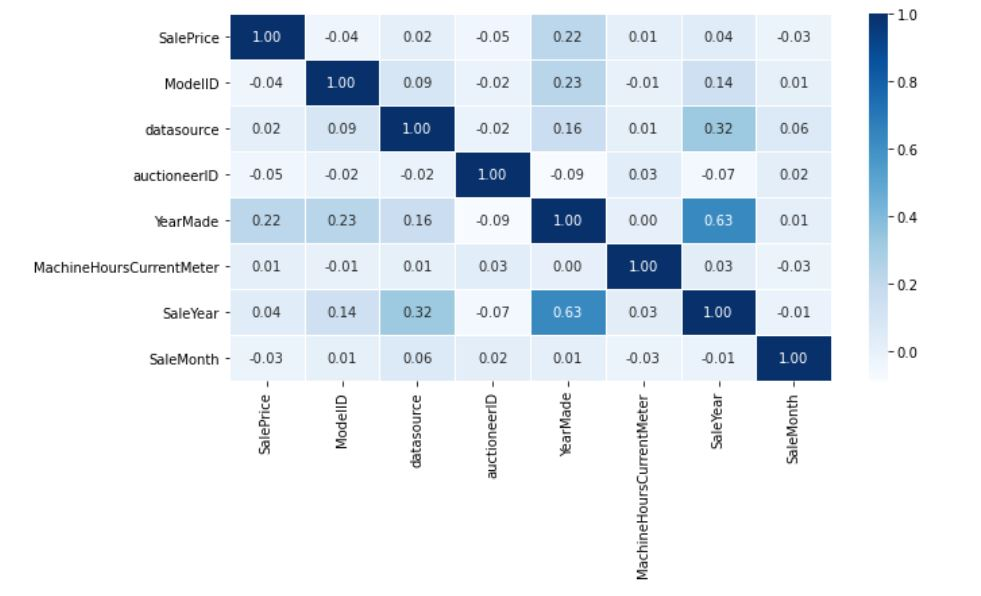
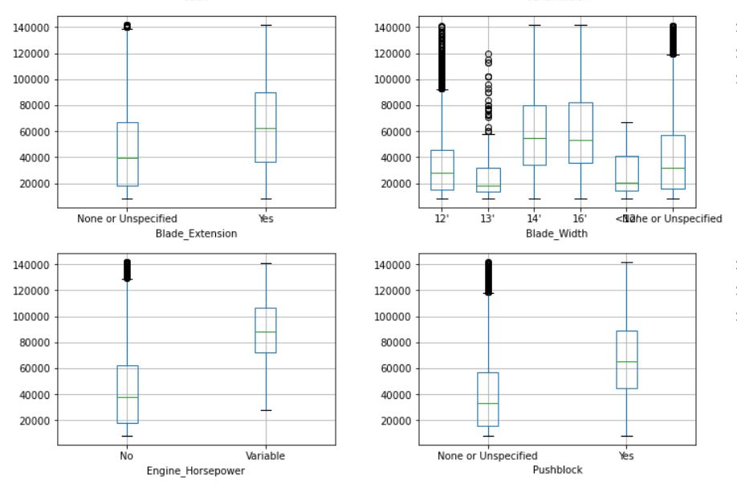
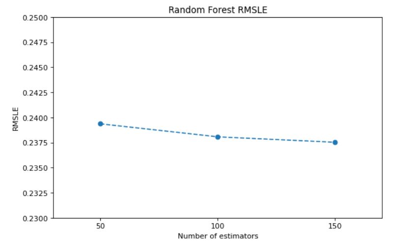

## Bulldozer Bluebook Price Prediction
This is the regression analysis predicting the sales price of bulldozers. The data files are provided by the [Kaggle Competition - Blue Book for Bulldozers](https://www.kaggle.com/c/bluebook-for-bulldozers/overview). It was a competition that Kaggle hosted several years ago.

### Data 
Data.zip is compressed CSV files containing train and valid set files. 

### Summary

#### EDA
Each row in the trainset had 52 columns of features. They include sales information such as sale date and auctioneer ID as well as product information like model ID. 

  

The target 'SalePrice' did not display particular correlation to numerical columns, except for the 'YearMade'. This finding enlarges the significance of categorical columns in the price prediction. 

  

The plotting between categorical values and SalePrice revealed some strong correlations between two. Accordingly, the performance of price prediction model heavily depends on categorical features rather than numerical.

#### Imputation
For numerical columns, some rows had non-sensical values in the 'YearMade' entry, which should be considered as missing. Any year < 1900 was converted to NaN. Then I created a dictionary of modelID: mode of yearmade, and replaced these missing entries.

For categorical columns, I dropped all features that are more than 70% missing and had more than 10 distinct values. A lot of columns were heavily missing the entries. (Few of them over 90% missing) There may be two possible reasons why these features are missing: 1) they are missing for no particular reason - perhaps failure to fill them out on the form 2) these features are not pertinent to the models being sold. To account for the first type of loss, I replicated the same approach as 'YearMade' column impuation, where I filled in the most frequent categorical value with respect to the models. When I saw that there still were missing entires, I imputed them with "other", as they probably should be considered as a distinct category.

#### Encoding
For any categorical columns with number of unique values fewer or equal to 4, I used one hot encoding. Else, I used target encoding, based on the finding that values in categorical columns were showing strong correlation with the target. 

#### Model Training
I used random forest regressor and XGB regressor. Random forest performed slightly better than XGB on a valid set. Through simple hyperparameter tuning, I was able to reduce root mean square logarithmic error (RMSLE) slightly. 

  

Since the Kaggle competition ended several years ago, I have no ways to compare the model performances to those of other people. However, 
